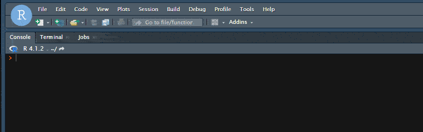
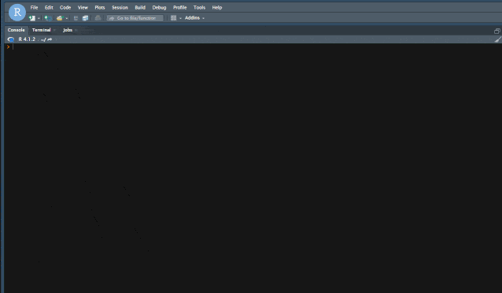
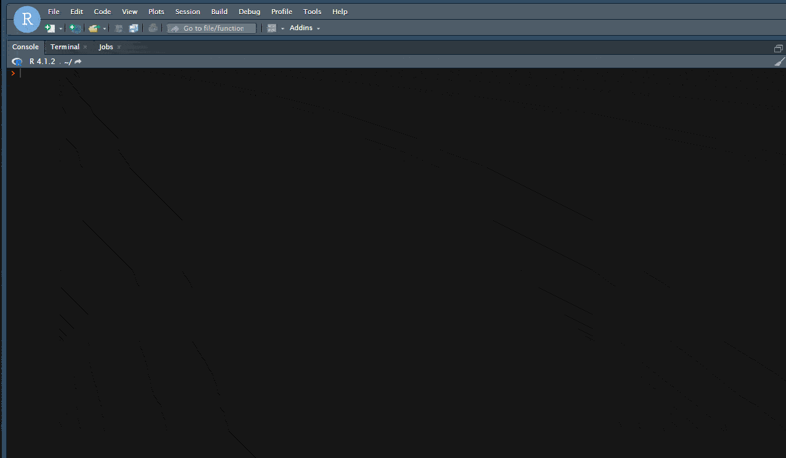

  
Starting from `Rnssp v. 0.1.0`, RStudio users may manage Rnssp R Markdown template with **Rnssp Addins**.


## Launch the addin {-}

In RStudio, you can use the *Addins* menu: 


## List Available Rnssp templates {-}

Users may check the list of all the currently available [Rnssp R Markdown templates](https://cdcgov.github.io/Rnssp-rmd-templates) with the *List Rnssp Templates* addin:



Or in the R console :

```r
Rnssp:::list_templates()
```


## Add/Update Rnssp Templates {-}

A unique feature of the `Rnssp` package is the ability to add R Markdown templates dynamically to an existing installation of the package. Rnssp R Markdown templates can be dynamically added or updated via the *Add/Update Rnssp Templates* addin:



Or in the R console :

```r
Rnssp:::add_rmd_template_gui()
```


## Remove Rnssp Templates {-}

When one or more Rnssp templates are no longer needed, they can be removed via the *Remove Rnssp Templates* addin:



Or in the R console :

```r
Rnssp:::remove_rmd_template_gui()
```

